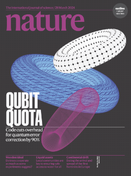

# Nature, Volume 627 Issue 8005, 28 March 2024

---

- **EDITORIAL**

    - [Deep-sea mining plans should not be rushed](https://www.nature.com/articles/d41586-024-00890-3)

        > It discusses the meeting held by the International Seabed Authority (ISA) in Kingston, Jamaica, which is considering regulations for deep-sea mineral extraction. According to *Nature*, countries like China are rushing to push through commercial mining rules for the deep sea, giving less consideration to deep-sea ecosystems.

- **WORLD VIEW**

    - [‘Exhausted and insulted’: how harsh visa-application policies are hobbling global research](https://www.nature.com/articles/d41586-024-00892-1)

        > An African scientist received a visa reject from the EU while attempting to attend an ecology meeting in Lisbon. She believes that these actions will **<u>impede</u>** efforts to address biodiversity loss because rich countries often restrict <u>researchers for low- and middle-income countries (LMICs) from</u> visiting due to concerns that they won’t return to their home countries. I think the author’s focus on visa application problems is not entirely precise. The true problem is much more serious than just the impact on academia; it reflects a broader trend of globalization retreat.

